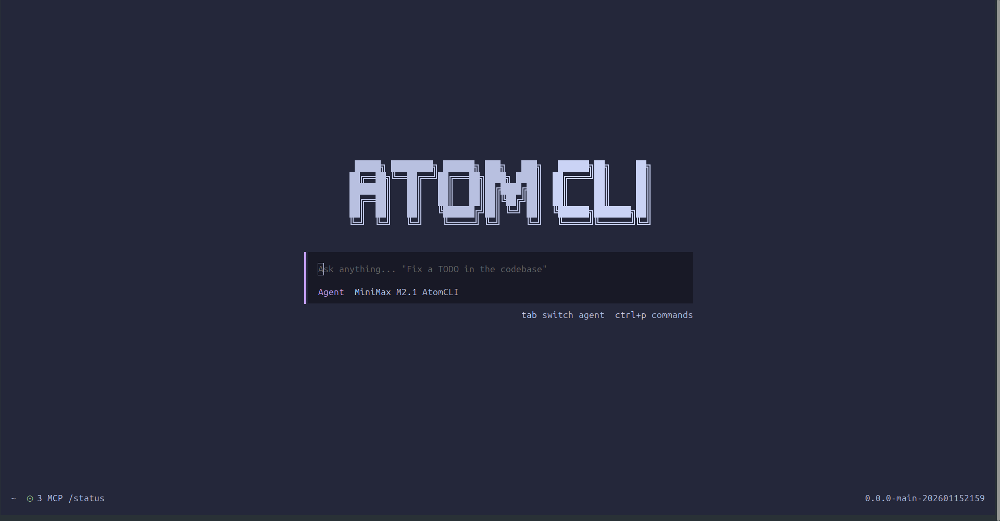
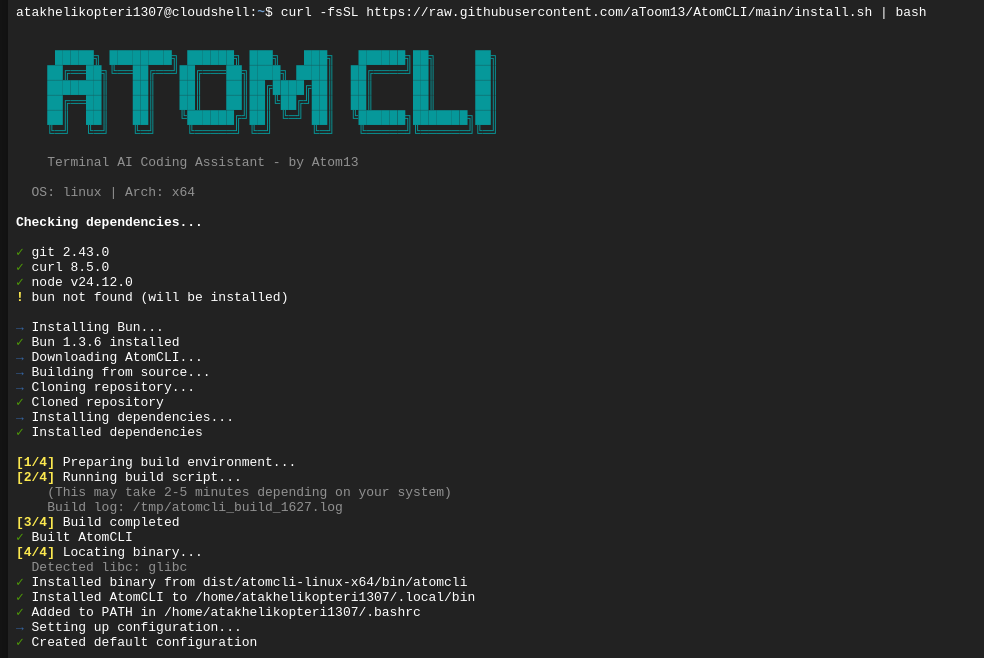

<div align="center">

# AtomCLI

```
            █████╗ ████████╗ ██████╗ ███╗   ███╗   ██████╗██╗     ██╗
           ██╔══██╗╚══██╔══╝██╔═══██╗████╗ ████║  ██╔════╝██║     ██║
           ███████║   ██║   ██║   ██║██╔████╔██║  ██║     ██║     ██║
           ██╔══██║   ██║   ██║   ██║██║╚██╔╝██║  ██║     ██║     ██║
           ██║  ██║   ██║   ╚██████╔╝██║ ╚═╝ ██║  ╚██████╗███████╗██║
           ╚═╝  ╚═╝   ╚═╝    ╚═════╝ ╚═╝     ╚═╝   ╚═════╝╚══════╝╚═╝
```

**Terminal AI Coding Assistant**

[](https://opensource.org/licenses/MIT)
[](https://github.com/aToom13/AtomCLI/stargazers)
[](https://github.com/aToom13/AtomCLI/issues)



</div>

---

## 🚀 Quick Install

```bash
curl -fsSL https://raw.githubusercontent.com/aToom13/AtomCLI/main/install.sh | bash
```
That's it! Run `atomcli` to start.

## ✨ Features

- **🖥️ Beautiful TUI** - Interactive terminal interface with mouse support
- **🤖 Free Models** - Use without API keys via built-in free providers (MiniMax, GLM, etc.)
- **🔧 MCP Support** - Extend capabilities with Model Context Protocol servers
- **📚 Skills System** - Add specialized behaviors from GitHub or locally
- **🔒 Privacy First** - All data stored locally, no telemetry

## 📦 Installation

### Linux / macOS (Recommended)

```bash
curl -fsSL https://raw.githubusercontent.com/aToom13/AtomCLI/main/install.sh | bash
```

### Windows (PowerShell)

```powershell
irm https://raw.githubusercontent.com/aToom13/AtomCLI/main/install.ps1 | iex
```

<details>
<summary>📸 See installation in action</summary>
<br>

</details>

### Manual Install

```bash
git clone https://github.com/aToom13/AtomCLI.git
cd AtomCLI && bun install
cd AtomBase && bun run build
cp dist/atomcli-linux-x64/bin/atomcli ~/.local/bin/
```

### Uninstall

```bash
curl -fsSL https://raw.githubusercontent.com/aToom13/AtomCLI/main/install.sh | bash -s -- --uninstall
```

## 🛠️ Usage

```bash
atomcli                 # Start interactive session
atomcli mcp list        # List MCP servers
atomcli skill list      # List available skills
```

<details>
<summary>📸 See it in action</summary>
<br>


*Multi-panel layout with file tree, ralph task list, and live coding*
</details>

### Adding MCP Servers

```
> Add memory-bank MCP
> Add filesystem MCP for /home/user/projects
```

### Adding Skills

```
> Add this skill: https://github.com/.../code-reviewer.md
```

## 🔧 Configuration

Config file: `~/.atomcli/atomcli.json`

```json
{
  "mcp": {
    "memory-bank": {
      "type": "local",
      "command": ["npx", "-y", "github:alioshr/memory-bank-mcp"],
      "enabled": true
    }
  }
}
```

## 🌍 Supported Platforms

| Platform            | Status |
| ------------------- | ------ |
| Linux x64           | ✅      |
| Linux ARM64         | ✅      |
| macOS x64           | ✅      |
| macOS ARM64 (M1/M2) | ✅      |
| Windows (WSL)       | ✅      |

## 📚 Documentation

- **[Development Guide](docs/DEVELOPMENT.md)** - Build, test, contribute

---

<div align="center">

**[⭐ Star on GitHub](https://github.com/aToom13/AtomCLI)** • **[Report Bug](https://github.com/aToom13/AtomCLI/issues)** • **[Request Feature](https://github.com/aToom13/AtomCLI/issues)**

Made by [Atom13](https://github.com/aToom13)

</div>
