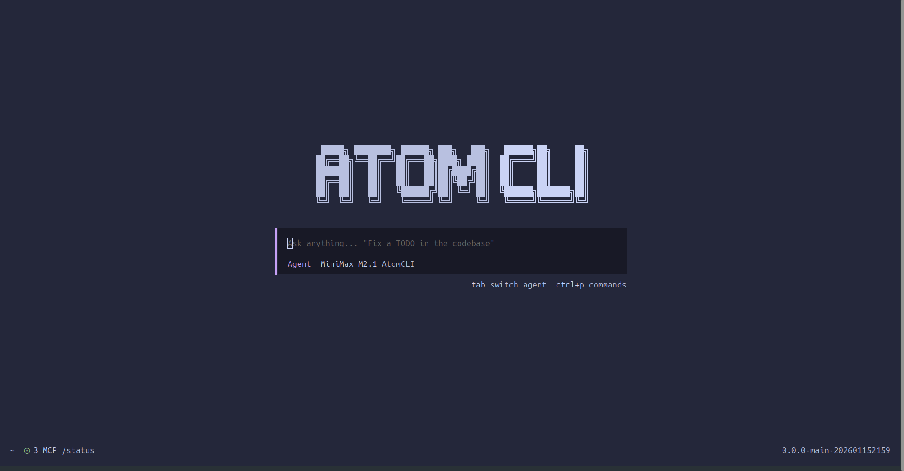
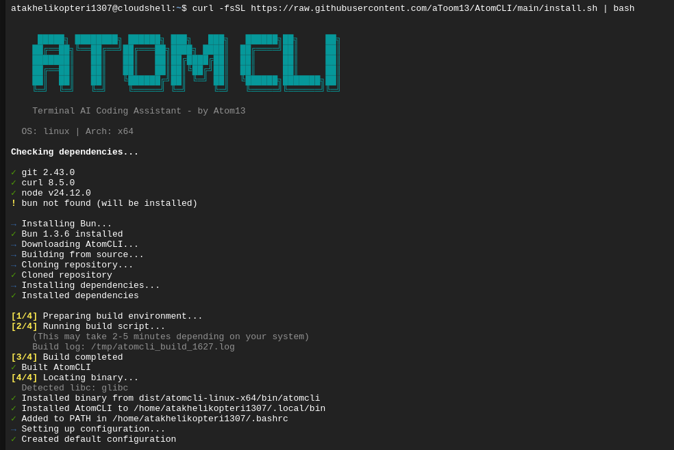

<div align="center">

# AtomCLI

```
           █████╗ ████████╗ ██████╗ ███╗   ███╗   ██████╗██╗     ██╗
          ██╔══██╗╚══██╔══╝██╔═══██╗████╗ ████║  ██╔════╝██║     ██║
          ███████║   ██║   ██║   ██║██╔████╔██║  ██║     ██║     ██║
          ██╔══██║   ██║   ██║   ██║██║╚██╔╝██║  ██║     ██║     ██║
          ██║  ██║   ██║   ╚██████╔╝██║ ╚═╝ ██║  ╚██████╗███████╗██║
          ╚═╝  ╚═╝   ╚═╝    ╚═════╝ ╚═╝     ╚═╝   ╚═════╝╚══════╝╚═╝
```

**AI-Powered Terminal Coding Assistant**

[](https://opensource.org/licenses/MIT)
[](https://github.com/aToom13/AtomCLI/stargazers)
[](https://github.com/aToom13/AtomCLI/issues)



</div>

---

## What is AtomCLI?

AtomCLI is an open-source, terminal-based AI coding assistant that helps developers write, debug, and refactor code directly from the command line. It provides an interactive TUI (Text User Interface) with full mouse support, multiple AI provider integrations, and extensibility through MCP servers and skills.

Unlike cloud-based solutions, AtomCLI stores all your data locally and gives you full control over which AI providers you use.

## What's New (v3.2.4-BetaDebug)

### Unified Memory System

- **Single `memory` tool** replaces the previous fragmented `brain`, `learn`, and MCP memory servers.
- **JSONL storage** at `~/.atomcli/memory.jsonl` — append-only, fault-tolerant, no database required.
- **Offline semantic search** via a Turkish↔English alias expansion system — queries like "kullanıcı adı" and "username" resolve to the same results without any embedding API.
- **Automatic migration** of legacy data on first use.
- **Proactive recall** — relevant memories are injected into the system prompt automatically before each response.

### Tool Consolidation

- **`find`** unifies the old `glob` and directory listing tools into a single interface.
- **`edit`** supports batched multi-edit operations via an `operations[]` array, replacing the old `multiedit` tool.
- **Removed** `fix_it`, `patch`, `glob`, `list`, `brain`, and `learn` tools — all functionality is covered by the remaining focused tools.
- Smaller system prompt overhead per session.

### SubAgent Architecture

- Centralized `SubAgent.spawn()` utility used by both `task` and `orchestrate` tools.
- Eliminates ~90 lines of duplicated sub-agent lifecycle management.
- Consistent context injection, permission enforcement, and error handling across all agent types.

### Companion Mobile App (Early Beta)

- **Mobile Remote Control**: Pair your phone with AtomCLI via QR code to monitor sessions, approve permissions, and chat with AI from your mobile device.
- **Real-Time Session Monitoring**: View active workflows, task status, and AI responses from the companion app.
- **Remote Permission Approval**: Approve or deny tool permissions and file edits directly from your phone.
- **Push Notifications**: Receive alerts when AI needs input, a task completes, or errors occur via ntfy.sh integration.
- **Secure Pairing**: End-to-end encrypted communication using public key cryptography. Devices are authenticated via short-lived pairing tokens.

> **Note**: The companion app is in early beta. Expect rough edges and breaking changes. The Flutter app supports Android and iOS.

### Orchestrate Improvements

- **Independent Tasks**: Tasks without dependencies now run even if other tasks fail
- **Automatic Retry**: Failed tasks retry with exponential backoff (1s → 2s → 4s), max 3 attempts
- **Custom Model Selection**: Specify a model per task using `model: "provider/model"` (e.g., `"atomcli/minimax-m2.5-free"`)
- **Improved UI**: Navigate between task sessions using `Ctrl+↑/↓` arrows
- **Better Tracking**: Task status, duration, and session IDs are now tracked

```json
{
  "action": "plan",
  "tasks": [
    { "id": "research", "prompt": "Research the codebase", "model": "atomcli/minimax-m2.5-free" },
    { "id": "code", "prompt": "Write code", "category": "coding" }
  ]
}
```

---

## Features

### Core Capabilities

- **Interactive TUI** - Beautiful terminal interface with mouse support, syntax highlighting, and multi-panel layouts
- **Multi-Provider Support** - Works with OpenAI, Anthropic, Google, Ollama, OpenRouter, and more
- **Free Models Available** - Use built-in free providers (MiniMax, GLM, Kimi, GPT, and more) without API keys
- **Antigravity Support** - Access Claude Sonnet and Gemini models for free via Google OAuth through the Antigravity plugin
- **Unified Memory** - Persistent cross-session memory with offline semantic search (Turkish↔English). Stores preferences, decisions, and project context in `~/.atomcli/memory.jsonl`
- **Code Intelligence** - File editing, code generation, debugging, and refactoring capabilities
- **Session Management** - Save and continue conversations, branch sessions, and manage history
- **Streaming Interrupt** - Send amendments while AI is writing (Shift+Enter)
- **Model Fallback** - Automatic failover when primary model fails

### Developer Tools

- **`atomcli test-gen`** - Automatically generate unit tests for source files
- **`atomcli docs`** - Generate JSDoc comments and API documentation
- **`atomcli security`** - Scan code for vulnerabilities and secrets
- **`atomcli perf`** - Analyze code for performance issues and Big-O complexity
- **`atomcli refactor`** - Detect code smells and suggest automated refactorings
- **`atomcli review`** - Review GitHub PRs automatically
- **`atomcli workspace`** - Manage multi-project workspace
- **`atomcli setup`** - Install optional dependencies (Playwright for browser automation)

### Extensibility

- **MCP Support** - Extend capabilities with Model Context Protocol servers for custom tools and integrations
- **Skills System** - Add specialized behaviors and workflows from GitHub repositories or local files
- **Custom Agents** - Configure different agent personas for various development tasks

### Privacy and Control

- **Local Storage** - All data stored locally in `~/.atomcli/`
- **No Telemetry** - No data collection or analytics
- **Configurable** - Full control over providers, models, and behavior

---

## Installation

### Linux / macOS

```bash
curl -fsSL https://raw.githubusercontent.com/aToom13/AtomCLI/main/install.sh | bash
```

### Windows (PowerShell)

```powershell
irm https://raw.githubusercontent.com/aToom13/AtomCLI/main/install.ps1 | iex
```

<details>
<summary>See installation in action</summary>
<br>

</details>

### Manual Installation

For development or custom setups:

```bash
git clone https://github.com/aToom13/AtomCLI.git
cd AtomCLI && bun install
cd AtomBase && bun run build
cp dist/atomcli-linux-x64/bin/atomcli ~/.atomcli/bin/
```

### Setup (Optional Dependencies)

Some AtomCLI features require additional dependencies:

```bash
atomcli setup                # Install optional dependencies (Playwright)
atomcli setup --check        # Check status without installing
```

The `setup` command installs **Playwright** for the browser automation tool, which enables:

- Web page navigation and interaction
- Screenshot capture
- JavaScript execution in browser context
- Console log monitoring

If Playwright is not installed, the browser tool will show a graceful error message with installation instructions.

### Updating

```bash
atomcli upgrade
```

AtomCLI automatically checks for updates on startup and notifies you when a new version is available.

For a manual update via the installer, use the `--update` flag. The installer will fetch the available release list from GitHub and let you pick a version interactively (defaults to latest after 30 seconds):

```bash
# Linux / macOS
curl -fsSL https://raw.githubusercontent.com/aToom13/AtomCLI/main/install.sh | bash -s -- --update

# Windows (PowerShell — run in a new terminal, not piped)
irm https://raw.githubusercontent.com/aToom13/AtomCLI/main/install.ps1 -OutFile update.ps1
.\update.ps1 -Update
```

You can also build and install directly from the latest source:

```bash
# Linux / macOS
curl -fsSL https://raw.githubusercontent.com/aToom13/AtomCLI/main/install.sh | bash -s -- --source

# Windows
.\update.ps1 -Source
```

### Uninstalling

```bash
atomcli --uninstall
```

Or via the installer script:

```bash
# Linux / macOS
curl -fsSL https://raw.githubusercontent.com/aToom13/AtomCLI/main/install.sh | bash -s -- --uninstall

# Windows (PowerShell — run in a new terminal, not piped)
irm https://raw.githubusercontent.com/aToom13/AtomCLI/main/install.ps1 -OutFile uninstall.ps1
.\uninstall.ps1 -Uninstall
```

---

## Usage

### Basic Commands

```bash
atomcli                      # Start interactive session
atomcli -c                   # Continue last session
atomcli -m anthropic/claude  # Start with specific model
atomcli --help               # Show all options

# Advanced Commands
atomcli models               # List all available models
atomcli stats                # Show token usage and cost statistics
atomcli smart-model          # Manage smart model routing
atomcli session list         # List and manage past sessions
atomcli agent                # Create and list custom agents
atomcli github install       # Install the GitHub agent
atomcli acp                  # Start ACP (Agent Client Protocol) server
atomcli export <id>          # Export session data as JSON
atomcli import <file>        # Import session data from JSON
```

### Run Command (Non-Interactive)

Execute a single prompt without the TUI:

```bash
atomcli run "fix the bug in auth.ts"                    # Run with default model
atomcli run -m google/gemini-pro "explain this code"     # Use specific model
atomcli run --agent coder "add error handling"           # Use a specific agent
cat file.ts | atomcli run "review this code"             # Pipe input
atomcli run --json "list all functions"                  # JSON output mode
```

### Session Workflow

AtomCLI provides a conversational interface where you can:

1. Ask questions about your codebase
2. Request code changes or new features
3. Debug issues with AI assistance
4. Review and approve file modifications

<details>
<summary>See it in action</summary>
<br>


_Multi-panel layout with file tree, task list, and live coding_

</details>

### Keyboard Shortcuts

| Key           | Action                               |
| ------------- | ------------------------------------ |
| `Tab`         | Switch agent                         |
| `Ctrl+P`      | Open command palette                 |
| `Ctrl+C`      | Cancel current operation             |
| `Shift+Enter` | Send amendment while AI is writing   |
| `Ctrl+↑/↓`    | Navigate task sessions (Orchestrate) |
| `Esc`         | Close dialogs                        |

---

## MCP Servers

Model Context Protocol (MCP) servers extend AtomCLI with additional capabilities.

### Managing MCP Servers

```bash
atomcli mcp list             # List installed MCP servers
atomcli mcp add <name>       # Add a new MCP server
atomcli mcp remove <name>    # Remove an MCP server
```

### Bundled MCP Server

- **sequential-thinking** - Step-by-step structured reasoning (included by default)

> **Note:** The `memory` and `filesystem` MCP servers previously bundled with AtomCLI have been replaced by the native `memory` tool and built-in file tools (`read`, `write`, `edit`, `find`, `grep`). These provide the same functionality without external processes.

### Adding Custom MCP Servers

```
> Add <name> MCP server
```

---

## Skills

Skills are specialized instructions that modify agent behavior for specific tasks.

### Managing Skills

```bash
atomcli skill list           # List installed skills
atomcli skill add <url>      # Add skill from GitHub
atomcli skill remove <name>  # Remove a skill
```

### Adding via Chat

```
> Add this skill: https://github.com/********
> Find and add ralph skill from github
```

Skills are stored in `~/.atomcli/skills/` and can be enabled/disabled per session.

---

## Configuration

### Config Files

| File                              | Purpose                                 |
| --------------------------------- | --------------------------------------- |
| `~/.atomcli/atomcli.json`         | Global settings + MCP config            |
| `<project>/.atomcli/atomcli.json` | Project-level config (overrides global) |
| `~/.atomcli/memory.jsonl`         | Persistent memory (JSONL)               |
| `~/.atomcli/skills/`              | Installed skills                        |
| `~/.atomcli/data/`                | Sessions, cache, tool output            |

### Example Configuration

```json
{
  "model": "anthropic/claude-sonnet-4",
  "autoupdate": "notify",
  "disabled_providers": ["openrouter"]
}
```

### Provider Configuration

Add API keys for providers:

```json
{
  "providers": {
    "anthropic": {
      "apiKey": "sk-..."
    },
    "openai": {
      "apiKey": "sk-..."
    }
  }
}
```

---

## Supported Platforms

| Platform | Architecture        | Variant          | Status    |
| -------- | ------------------- | ---------------- | --------- |
| Linux    | x64                 | glibc            | Supported |
| Linux    | ARM64               | glibc            | Supported |
| Linux    | x64                 | glibc (baseline) | Supported |
| Linux    | x64                 | musl (Alpine)    | Supported |
| Linux    | ARM64               | musl (Alpine)    | Supported |
| Linux    | x64                 | musl (baseline)  | Supported |
| macOS    | ARM64 (M1/M2/M3/M4) | -                | Supported |
| macOS    | x64 (Intel)         | -                | Supported |
| macOS    | x64 (Intel)         | baseline         | Supported |
| Windows  | x64                 | -                | Supported |
| Windows  | x64                 | baseline         | Supported |

---

## Architecture

AtomCLI is built with:

- **Bun** - JavaScript runtime and bundler
- **SolidJS** - Reactive UI framework for the TUI
- **OpenTUI** - Terminal UI rendering library
- **Vercel AI SDK** - Multi-provider AI integration
- **Hono** - Lightweight HTTP server for local API

### Project Structure

```
AtomCLI/
├── AtomBase/                # Main application source
│   ├── src/
│   │   ├── interfaces/      # CLI commands and TUI
│   │   ├── core/            # Session, config, prompt system
│   │   ├── integrations/    # Tools, providers, agents, MCP
│   │   └── services/        # File, auth, patch services
├── companion/               # Flutter mobile companion app (Android/iOS)
├── libs/
│   ├── companion/           # @atomcli/companion - pairing & bridge logic
│   ├── sdk/                 # JavaScript/TypeScript SDK
│   ├── enterprise/          # Web dashboard (SolidJS + Vite)
│   ├── ui/                  # Shared UI components
│   ├── util/                # Utility functions
│   └── plugin/              # Plugin system
├── .atomcli/                # Bundled skills & agents (included in releases)
├── docs/                    # Documentation
└── install.sh               # Installation script
```

---

## Development

### Prerequisites

- [Bun](https://bun.sh/) v1.3 or later
- Git

### Building from Source

```bash
git clone https://github.com/aToom13/AtomCLI.git
cd AtomCLI
bun install
cd AtomBase
bun run dev    # Development mode
bun run build  # Production build
```

### Running Tests

```bash
bun test
```

For more details, see the [Development Guide](docs/DEVELOPMENT.md).

---

## Documentation

- [Development Guide](docs/DEVELOPMENT.md) - Build, test, contribute
- [Providers Guide](docs/PROVIDERS.md) - AI provider configuration and API keys
- [MCP Guide](docs/MCP-GUIDE.md) - MCP server installation and development
- [Skills Guide](docs/SKILLS-GUIDE.md) - Skill development and usage

---

## License

AtomCLI is released under the [MIT License](LICENSE).

---

<div align="center">

**[Star on GitHub](https://github.com/aToom13/AtomCLI)** | **[Report Bug](https://github.com/aToom13/AtomCLI/issues)** | **[Request Feature](https://github.com/aToom13/AtomCLI/issues)**

Made by [Atom13](https://github.com/aToom13)

</div>